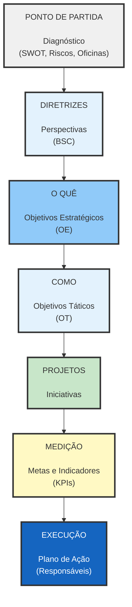

A partir de todas as oficinas, identificação de riscos, forças, fraquezas, oportunidades, ameaças e de todas as entrevistas e trabalhos de mapeamento realizados, foi possível definir perspectivas que funcionam como diretrizes para a definição de objetivos estratégicos.

Estes objetivos se desdobram em objetivos táticos, que serão trabalhados a partir de iniciativas com metas e indicadores de avaliação.

Essas iniciativas estarão conectadas ao plano de ação de cada um que tem papel ativo na Fundação Josué Montello.

