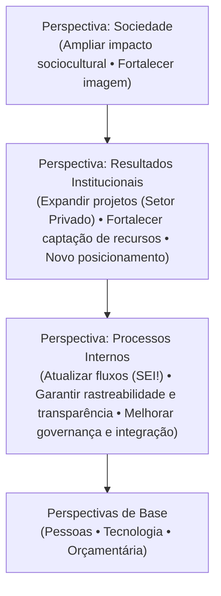

## Sobre 

O Mapa Estratégico consolida visualmente a lógica de causa e efeito do nosso plano. Ele demonstra como os investimentos nas perspectivas de base (Orçamentária, Pessoas e Tecnologia) permitem a excelência nos Processos Internos, que, por sua vez, entregam os Resultados Institucionais esperados e cumprem nossa missão de Contribuição para a Sociedade.

<CardGroup cols={1}>
<Card title="Missão, Visão e Valores" href="/identidade-organizacional">

Veja os Valores, Missão e Visão da Fundação em mais detalhes na seção de Identidade Organizacional.

</Card>
</CardGroup>

## Visualização em Diagrama 

## Perspectiva: Sociedade

- **Foco**: Contribuição para a Sociedade.
- **Principais direcionadores**:
  - Ampliar impacto sociocultural.
  - Fortalecer imagem institucional.

## Perspectiva: Resultados Institucionais

- **Foco**: Resultados Institucionais.
- **Principais direcionadores**:
  - Expandir projetos (setor privado).
  - Fortalecer captação de recursos.
  - Consolidar o novo posicionamento da Fundação.

## Perspectiva: Processos Internos

- **Foco**: Excelência em Processos Internos.
- **Principais direcionadores**:
  - Atualizar fluxos (SEI!).
  - Garantir rastreabilidade e transparência.
  - Melhorar governança e integração.

## Perspectivas de Base

As perspectivas de base sustentam todo o mapa estratégico e viabilizam os resultados nas demais dimensões.

| Perspectiva de Base | Foco Principal                          | Principais Direcionadores                                                       |
|---------------------|------------------------------------------|----------------------------------------------------------------------------------|
| Pessoas             | Cultura e gestão de pessoas              | Fortalecer cultura • Consolidar gestão (PCCS, Onboarding)                        |
| Tecnologia          | Sistemas, infraestrutura e segurança     | Integrar sistemas • Melhorar infraestrutura • Garantir segurança                 |
| Orçamentária        | Sustentabilidade e diversificação de receitas | Assegurar sustentabilidade • Ampliar fontes de receita                         |

